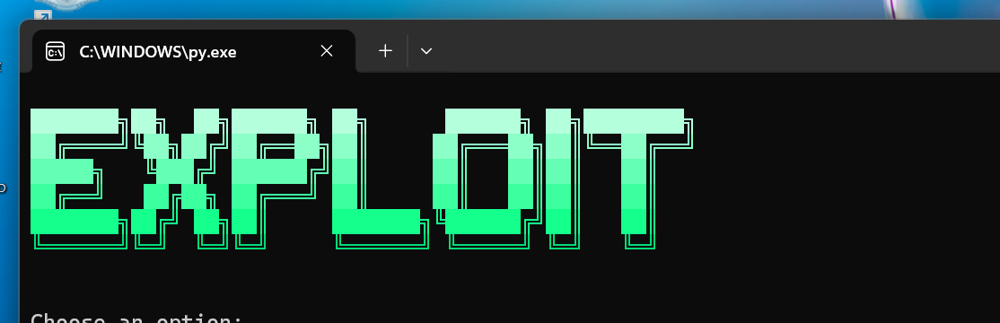
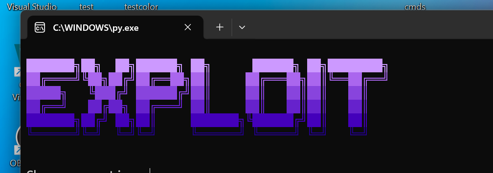
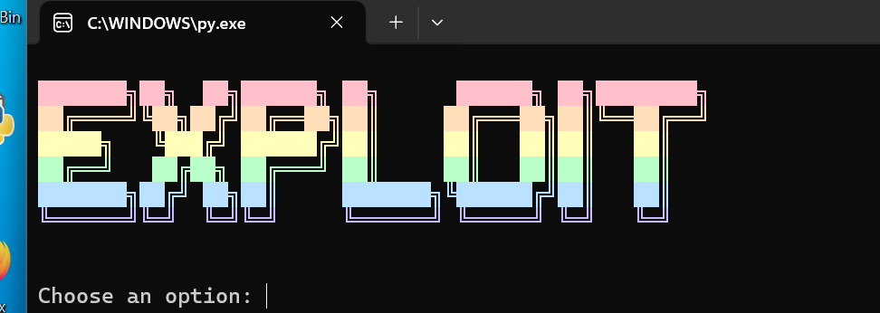
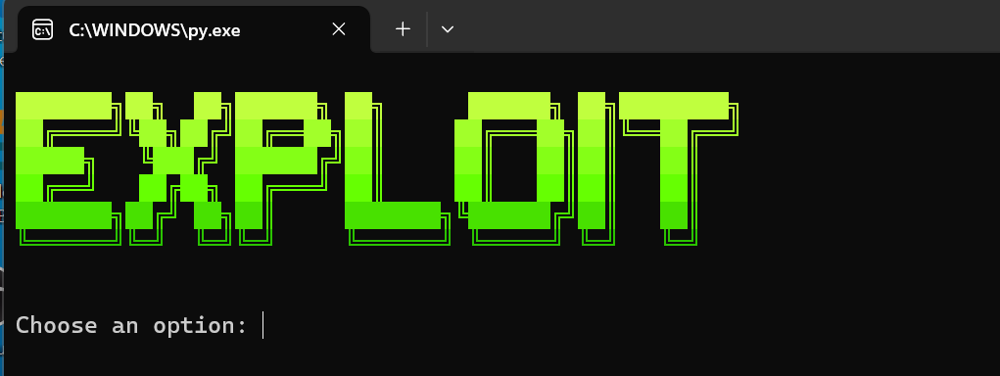

# termgrad  
Made by wock2009  
Site: [https://coderhangout.xyz](https://coderhangout.xyz)  

---

## Why choose termgrad?  
`termgrad` is a clean and colorful package for terminal output.  
Easily apply vibrant gradients and stylish effects to your CLI tools with minimal effort.  
Includes a wide range of smooth and visually pleasing color sets.

---

## Examples

  
  
  

